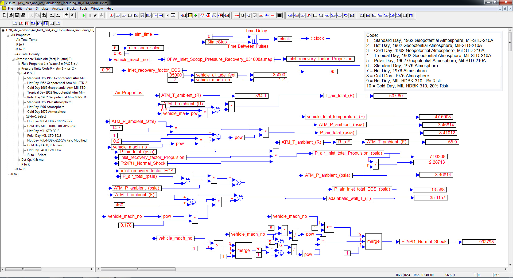
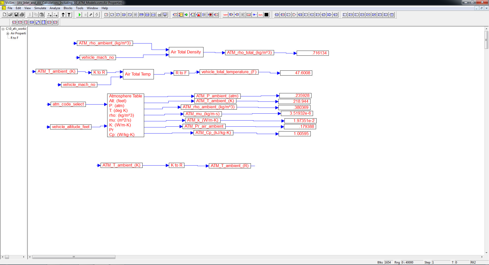
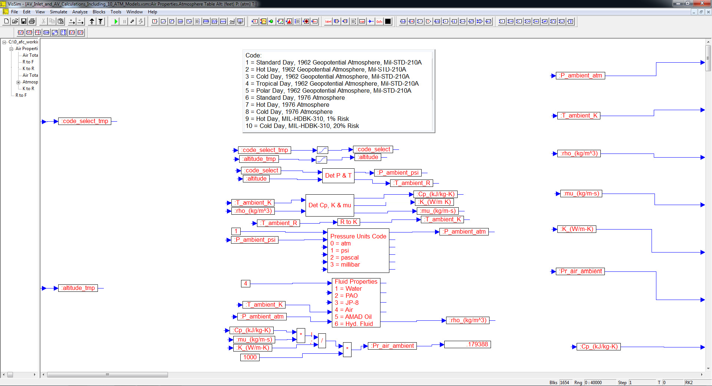
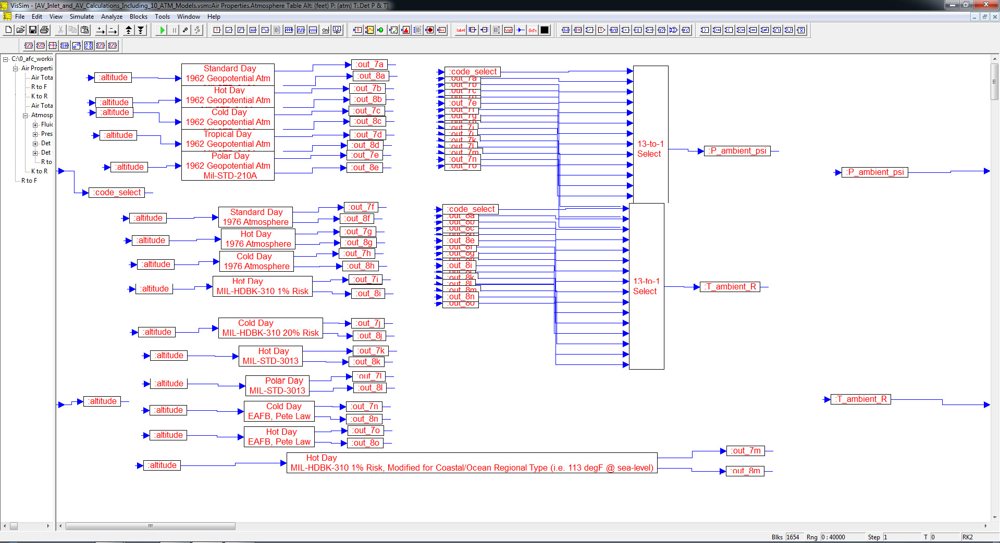
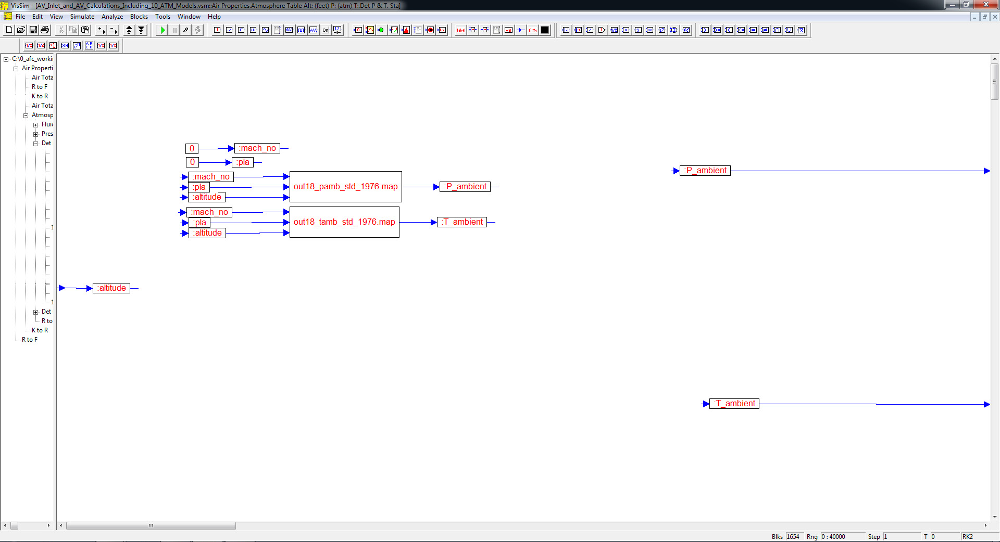

# ========================================
# Air-Inlet and Air Vehicle Calculations Including (10) Atmospheric Models Using VISSIM:
# ========================================

## I. Top-Level Diagram:

## 
## 
## II. Air-Properties Sub-Model Level Diagram:

## 
## 
## III. Atmosphere Table Sub-Model Level Diagram:

## 
## 
## IV. Ten Atmosphere Models Sub-Model Level Diagram:

## 
## 
## V. 1976 Standard Atmosphere Model Sub-Model Level Diagram:

## 
## *Note: Performance Data and Analysis performed using VISSIM, ( https://web.solidthinking.com/vissim-is-now-solidthinking-embed )